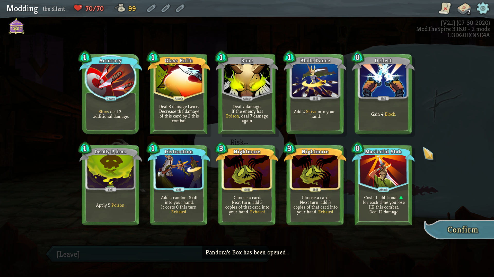

Customize your Slay The Spire seeds. Upon starting a run, this mod will repeatedly refresh at the Neow screen until you generate a seed with your desired parameters. Currently, this mod only supports a single filter - "Pandora's Box" boss swaps - but more filters are planned and further customization options are in the works.

### Important notes

* **Pandora's Box must be unlocked to use this mod!** - This is from the Silent's fourth unlock tier - if you make a brand new user account you will simply keep rerolling until it hits the safety limit (200 seeds maximum) as you won't have the relic available in the pool. There are mods that unlock everything first to skip this requirement (or you can just play a few silent runs and get enough experience for the unlock)
* Seeds are simply rerolled until you get the "Pandora's Box" as the Neow boss swap option - everything else is vanilla! The seed should work identically to those generated without the mod, as no actual changes are made. (This is different than some other Pandora's Box mods, as they forcibly replace the starter relic and can run into other side effects because of it - this just searches for a seed that has the start desired without touching any of the RNG code)
* A small cheat is in place to guarantee four choices at Neow (usually you would need to reach at least the first boss) - the logic here is that if you have the mod installed you are probably looking to boss swap regardless of whether or not your previous run made it to the Act 1 boss
* This mod is under active development - more features (especially customization / config) are planned

### Installation

This mod requires ModTheSpire and BaseMod, which can be found on the Steam Workshop. To install this mod, head over to the [Releases page](https://github.com/casey-c/BossSwapSeedRefresh/releases), download the latest .jar file, and drag it into the SlayTheSpire/mods folder in your game's install directory. Eventually I'll get around to uploading it to the Steam workshop (I very lazily haven't done so for any of my mods yet because the workshop upload utility is broken for my Linux distribution) but for now you will need to check back manually for updates - sorry!
