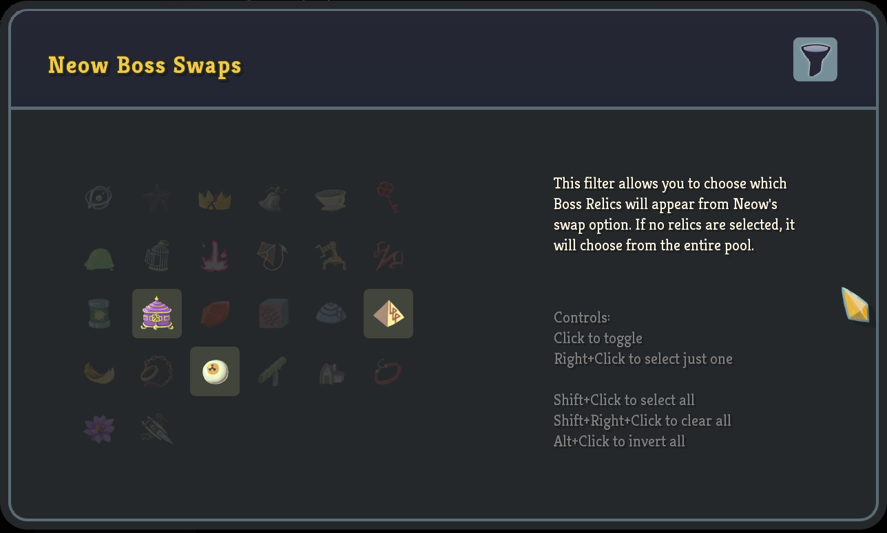

# Filter the Spire

Customize your Slay The Spire seeds! Upon starting a run, this mod will repeatedly refresh at the Neow screen until you generate a seed with your desired parameters. The parameters of your run can be adjusted in the Main Menu -> Mods -> Filter the Spire -> Config menu. Currently there's only one filter implemented so far: customizable boss swaps!

Head down to the [Installation](#installation) section below to learn how to get this mod in your game!

## How it Works

* Upon starting a run, this mod will attempt to find a seed that fits all your specified parameters chosen in the in game config menu (shown above). The mod will continously refresh the start of the game until your settings are satisfied, giving you access to seeds that you are actually interested in playing!
* This mod attempts to have vanilla compatibility - we actually search for valid seeds rather than force them to happen manually. This means any seed you find will be shareable to be played by any PC player, with or without this mod installed!
* A small cheat is in place to guarantee four choices at Neow (usually you would need to reach at least the first boss) - the logic here is that if you have the mod installed you are probably looking to boss swap regardless of whether or not your previous run made it to the Act 1 boss
* This mod is under active development - more features and filters are planned for the near future!

## How to Use

Install the mod and prerequesites as described below. Launch Slay the Spire (use the "Play with Mods" option on Steam to get the ModTheSpire loader on launch). Make sure to check the box next to "Filter the Spire" to enable it. 

To set up your desired filters, go to Main Menu -> Mods -> Filter the Spire, and click the small "Config" button. This should bring up a menu to choose which relics you wish to find if you boss swap at Neow. This is the only filter currently working, but more should be coming within the next few weeks.

**NOTE: currently the settings aren't saved between launches of the game, so you'll have to put them in each time - sorry!**

After setting up your desired options, you can return to the Main Menu and start a new game. You may see a brief popup screen showing how many seeds the program examined while looking for your parameters and may encounter a small wait as it searches through randomly generated seeds. After it finds one, you will be presented with an entirely vanilla game of StS that you can play as normal! If you click the boss swap option, you'll be guaranteed a boss relic that fits the filters you set up originally.

## Installation

This mod requires ModTheSpire and BaseMod, which can both be found on the Steam Workshop. To install this mod, head over to the [Releases page](https://github.com/casey-c/FilterTheSpire/releases), download the latest .jar file, and drag it into the SlayTheSpire/mods folder in your game's install directory. Eventually I'll get around to uploading it to the Steam workshop but for now you will need to check back manually for updates - sorry! (The mod upload utility is broken for my particular Linux distribution so it's been easier to just push it here to Github)

## FAQ

* Why search for seeds and not just force in the relic? 

This is a valid question! Currently, the mod is designed to have an entirely vanilla experience - any seeds you find will be unaltered from the vanilla game and can be sent to friends to play as is (without needing this mod installed at all!). Mods that forceably swap your starter relic need to do so carefully to ensure that the swapped relic doesn't occur again as a future boss relic reward - and need to take some subtle care to avoid affecting any of the run's hidden RNG mechanics. In the future, this mod will hopefully support both possible interactions for impatient players that want to skip the wait, but for now the seeds it searches for are entirely base game friendly.

* Why didn't I get any of the relics I selected?

Double check to make sure the selected relics are unlocked on the profile you're using. One popular swap is Pandora's Box, which isn't unlocked at the beginning of the game (it's Silent's fourth unlock) - if you only choose relics you don't have access to, the seed finding algorithm won't be able to find you a seed you can play. In the future, I'd like it to be a bit more transparent about whether or not the parameters will be be valid. There's also an upper limit of 300 seeds it searches as a safety mechanism so you don't get infinitely stuck waiting. With the current filters and vanilla boss relic pool, reaching this limit is statistically impossible so there is likely to be another issue at play. **EDIT: I've been informed I've accidentally allowed the upgraded starter relics into the pool - these actually can't be swapped into, so if you just select these you will hit the limit and get a normal run**

* Why aren't my settings saved between launches of Slay the Spire?

Working on it! I haven't implemented this yet but it's very high priority.

## Issues / Bugs / Feedback

Please drop me a line here on the [issues page](https://github.com/casey-c/FilterTheSpire/issues) if you encounter bugs, weird behavior, crashes, mod incompatibilities, etc. As the mod is under active development, you can also leave feedback, suggestions, or requests there as well. Thank you!

## Other Mods

Feel free to check out some of my other (Github exclusive) mods!

* [InfoMod](https://github.com/casey-c/spiretool-infomod) - display A20 monster AI patterns, potion chances, and other hidden aspects of the game in a user friendly set of overlays
* [BetterPaths](https://github.com/casey-c/sts_betterpaths) - highlight your map and plan your route in an all new style of path planning. Easily track which nodes you wish to travel to in the future, and which ones to avoid.
