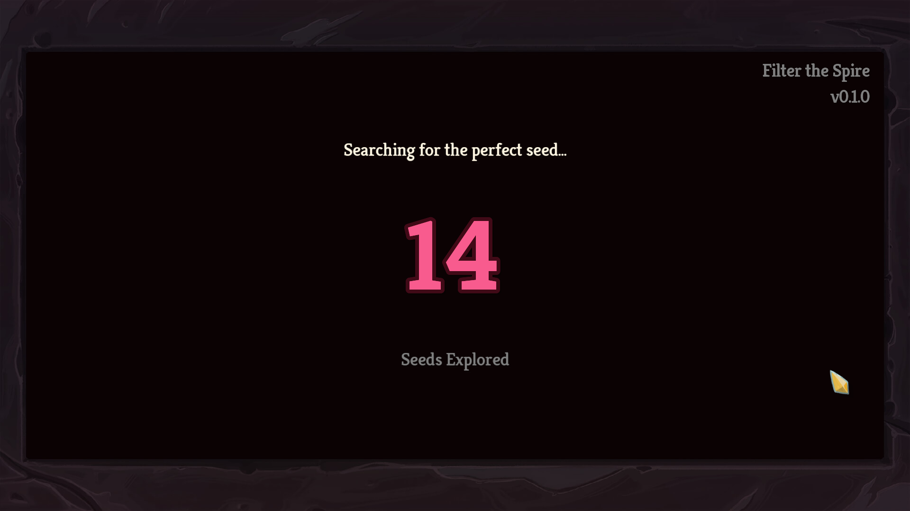

# Filter the Spire

Customize your Slay The Spire seeds! Upon starting a run, this mod will repeatedly refresh at the Neow screen until you generate a seed with your desired parameters. Currently, this mod only supports a single filter - *Pandora's Box* boss swaps - but more filters are planned and further customization options are in the works.

Jump down to the [Installation](#installation) section below to learn how to get this mod in your game!

## Important notes

* **Pandora's Box must be unlocked to use this mod!** - This is from the Silent's fourth unlock tier - if you make a brand new user account you will simply keep rerolling until it hits the safety limit (200 seeds maximum) as you won't have the relic available in the pool. There are mods that unlock everything first to skip this requirement (or you can just play a few silent runs and get enough experience for the unlock)
* Seeds are simply rerolled until you get the "Pandora's Box" as the Neow boss swap option - everything else is vanilla! The seed should work identically to those generated without the mod, as no actual changes are made. (This is different than some other Pandora's Box mods, as they forcibly replace the starter relic and can run into other side effects because of it - this just searches for a seed that has the start desired without touching any of the RNG code)
* A small cheat is in place to guarantee four choices at Neow (usually you would need to reach at least the first boss) - the logic here is that if you have the mod installed you are probably looking to boss swap regardless of whether or not your previous run made it to the Act 1 boss
* This mod is under active development - more features (especially customization / config) are planned

## How to Use

Install the mod and prerequesites as described below. Launch Slay the Spire (use the "Play with Mods" option on Steam to get the ModTheSpire loader on launch). Make sure to check the box next to "Filter the Spire" to enable it. When you click "Play" on the main menu screen, you will be given a short loading screen as it searches for a seed with Pandora's Box as the boss swap relic. There is a current maximum limit of 200 retries as it randomly tries seeds until it finds one that works. After it finds one, you'll be able to play the game entirely as normal!

## Installation

This mod requires ModTheSpire and BaseMod, which can be found on the Steam Workshop. To install this mod, head over to the [Releases page](https://github.com/casey-c/FilterTheSpire/releases), download the latest .jar file, and drag it into the SlayTheSpire/mods folder in your game's install directory. Eventually I'll get around to uploading it to the Steam workshop (I very lazily haven't done so for any of my mods yet because the workshop upload utility is broken for my Linux distribution) but for now you will need to check back manually for updates - sorry!

## FAQ

* Why search for seeds and not just force in the relic? 

This is a valid question! Currently, the mod is designed to have an entirely vanilla experience - any seeds you find will be unaltered from the vanilla game and can be sent to friends to play as is (without needing this mod installed at all!). Mods that forceably swap your starter relic need to do so carefully to ensure that Pandora's Box doesn't occur again as a future boss relic reward - and need to take some subtle care to avoid affecting any of the run's hidden RNG mechanics. In the future, this mod will hopefully support both possible interactions for impatient players that want to skip the wait, but for now the seeds it searches for are entirely base game friendly.

* I didn't get Pandora's Box after waiting the entire 200 seeds! What gives?

You probably don't have the relic unlocked! It is the fourth unlock for the Silent character, so you'll need to play a few more games with her to get enough experience to unlock it! If you've started a new profile, this may also be the culprit as you probably won't have unlocked everything yet. Side note: if you are confident you have it unlocked, then please leave a bug report on the issues page to let me know if there's a problem with the code!

## Issues / Bugs / Feedback

Please drop me a line here on the [issues page](https://github.com/casey-c/FilterTheSpire/issues) if you encounter bugs, weird behavior, crashes, mod incompatibilities, etc.

As the mod is under active development, you can also leave feedback, suggestions, or requests there as well. Thank you!

## Other Mods

Feel free to check out some of my other (Github exclusive) mods!

* [InfoMod](https://github.com/casey-c/spiretool-infomod) - display A20 monster AI patterns, potion chances, and other hidden aspects of the game in a user friendly set of overlays
* [BetterPaths](https://github.com/casey-c/sts_betterpaths) - highlight your map and plan your route in an all new style of path planning. Easily track which nodes you wish to travel to in the future, and which ones to avoid.
